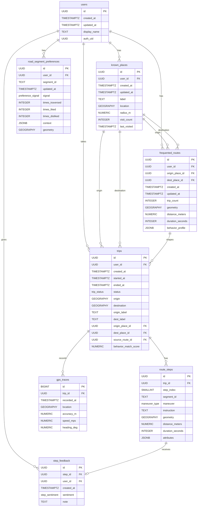

# Database Schema

```mermaid
erDiagram
    users {
        UUID id PK
        TIMESTAMPTZ created_at
        TIMESTAMPTZ updated_at
        TEXT display_name
        UUID auth_uid
    }

    known_places {
        UUID id PK
        UUID user_id FK
        TIMESTAMPTZ created_at
        TIMESTAMPTZ updated_at
        TEXT label
        GEOGRAPHY location
        NUMERIC radius_m
        INTEGER visit_count
        TIMESTAMPTZ last_visited
    }

    frequented_routes {
        UUID id PK
        UUID user_id FK
        UUID origin_place_id FK
        UUID dest_place_id FK
        TIMESTAMPTZ created_at
        TIMESTAMPTZ updated_at
        INTEGER trip_count
        GEOGRAPHY geometry
        NUMERIC distance_meters
        INTEGER duration_seconds
        JSONB behavior_profile
    }

    trips {
        UUID id PK
        UUID user_id FK
        TIMESTAMPTZ created_at
        TIMESTAMPTZ started_at
        TIMESTAMPTZ ended_at
        trip_status status
        GEOGRAPHY origin
        GEOGRAPHY destination
        TEXT origin_label
        TEXT dest_label
        UUID origin_place_id FK
        UUID dest_place_id FK
        UUID source_route_id FK
        NUMERIC behavior_match_score
    }

    route_steps {
        UUID id PK
        UUID trip_id FK
        SMALLINT step_index
        TEXT segment_id
        maneuver_type maneuver
        TEXT instruction
        GEOGRAPHY geometry
        NUMERIC distance_meters
        INTEGER duration_seconds
        JSONB attributes
    }

    step_feedback {
        UUID id PK
        UUID step_id FK
        UUID user_id FK
        TIMESTAMPTZ created_at
        step_sentiment sentiment
        TEXT note
    }

    gps_traces {
        BIGINT id PK
        UUID trip_id FK
        TIMESTAMPTZ recorded_at
        GEOGRAPHY location
        NUMERIC accuracy_m
        NUMERIC speed_mps
        NUMERIC heading_deg
    }

    road_segment_preferences {
        UUID id PK
        UUID user_id FK
        TEXT segment_id
        TIMESTAMPTZ updated_at
        preference_signal signal
        INTEGER times_traversed
        INTEGER times_liked
        INTEGER times_disliked
        JSONB context
        GEOGRAPHY geometry
    }

    users ||--o{ known_places : "has"
    users ||--o{ frequented_routes : "has"
    users ||--o{ trips : "takes"
    users ||--o{ step_feedback : "gives"
    users ||--o{ road_segment_preferences : "has"

    known_places ||--o{ frequented_routes : "origin"
    known_places ||--o{ frequented_routes : "destination"
    known_places ||--o{ trips : "origin"
    known_places ||--o{ trips : "destination"

    frequented_routes ||--o{ trips : "shapes"

    trips ||--o{ route_steps : "has"
    trips ||--o{ gps_traces : "records"

    route_steps ||--o| step_feedback : "receives"
```
